  

 

  <a href="README.md">🇺🇸 English</a> | <a href="README.pt-br.md">🇧🇷 Português</a> | <a href="README.es.md">🇪🇸 Español</a> | <a href="README.fr.md">🇫🇷 Français</a> | <b>🇩🇪 Deutsch</b> | <a href="README.ru.md">🇷🇺 Русский</a>

 

<!-- APRESENTAÇÃO DINÂMICA COM TYPING SVG -->

  

 

## 👨🏾‍💻 Über mich

🎯 **Software-Analyst & Entwickler** | **Unternehmer** | **Freelancer**  
🧠 Ich lerne aus Leidenschaft und löse Probleme von Anfang bis Ende – vom Stecker bis zum Benutzer.  
🚀 Technologie mit KI im Kern transformiert Unternehmen und Leben.  
🌎 _Lösungen bauen, die zählen._

---

## 🌟 Meine Kultur – Werte, die meine Arbeit leiten

| &nbsp; | &nbsp; | &nbsp; |
| :-----------------------------------------------------------------------: | :-------------------------------------------------------------------------------: | :--------------------------------------------------------------------: |
|   **🧠 Eigenverantwortung** _Ich übernehme die Verantwortung, bis es gelöst ist_    | **🎯 Problem = Chance** _Jede Herausforderung birgt eine Chance zur Wertschöpfung_ |   **🗣️ Menschlicher Dialog** _Code wird von Menschen für Menschen geschrieben_    |
|    **🤓 Nerd Thinking** _Tiefe Neugier führt zu eleganten Lösungen_     |   **🤖 KI-Lösungen Zuerst** _KI ist kein Add-on, sondern der Ausgangspunkt_    | **📊 Datenorientierte Sicht** _Entscheidungen basieren auf Fakten, nicht auf Vermutungen_ |
| **🫶 Sorgfalt bei der Lieferung** _Mit Sorgfalt und Präzision liefern_ |          **⚙️ Rationale Ausführung** _Planen, ausführen, messen, wiederholen_           |                                                                        |

> _Jede Zeile Code ist eine Entscheidung. Jede Entscheidung spiegelt wider, wer wir sind._

---

## 🛠️ Haupt-Stack & Studienschwerpunkt

### Back‑End

### Front‑End

### Databases & Knowledge Management

### Data (BI / Data Science)

### AI & Automation

### QA (Quality Assurance)

### DevOps

### IDEs

### Operating Systems

---

## 📐 Architektur, Methodiken & Sprachen

### ⚙️ Software-Engineering & Grundlagen

### 🌐 Architektur & Protokolle

### 📊 Geschäftsanalyse & Problemlösung

### 🗣️ Sprachen

---

## 📫 Kontakt aufnehmen

  
  
  

---

<!-- RODAPÉ COM ONDA -->

  

