<!-- CABEÇALHO COM BANNER PERSONALIZADO (cores: #FF808B e #73322C, texto branco) -->

 

  <b>🇺🇸 English</b> | <a href="README.pt-br.md">🇧🇷 Português</a> | <a href="README.es.md">🇪🇸 Español</a> | <a href="README.fr.md">🇫🇷 Français</a> | <a href="README.de.md">🇩🇪 Deutsch</a> | <a href="README.ru.md">🇷🇺 Русский</a>

 

<!-- APRESENTAÇÃO DINÂMICA COM TYPING SVG - URL CORRIGIDA -->

  

 

## 👨🏾‍💻 About me

🎯 **Analyst & Software Developer** | **Entrepreneur** | **Freelancer**  
🧠 I learn for pleasure and solve problems end‑to‑end – from the socket to the user.  
🚀 Technology applied with AI at its core transforms businesses and lives.  
🌎 _Building solutions that matter._

---

## 🌟 My culture – Values that guide my work

|                                                                           |                                                                                   |                                                                        |
| :-----------------------------------------------------------------------: | :-------------------------------------------------------------------------------: | :--------------------------------------------------------------------: |
|   **🧠 Self‑accountability** _I own the problem until it's solved_    | **🎯 Problem = Opportunity** _Every challenge hides a chance to create value_ |   **🗣️ Human Dialogue** _Code is written by people, for people_    |
|    **🤓 Nerd Thinking** _Deep curiosity drives elegant solutions_     |   **🤖 IA Solutions First** _AI is not an add‑on, it's the starting point_    | **📊 Data Driven View** _Decisions grounded on facts, not guesses_ |
| **🫶 Tenderness in Value Delivery** _Deliver with care and precision_ |          **⚙️ Rational Execution** _Plan, execute, measure, repeat_           |                                                                        |

> _Every line of code is a decision. Every decision reflects who we are._

---

## 🛠️ Core Tech Stack & Focus of Study

### Back‑End

### Front‑End

### Databases & Knowledge Management

### Data (BI / Data Science)

### AI & Automation

### QA (Quality Assurance)

### DevOps

### IDEs

### Operating Systems

---

## 📐 Architecture, Methodologies & Languages

### ⚙️ Software Engineering & Foundations

### 🌐 Architecture & Protocols

### 📊 Business Analysis & Problem Solving

### 🗣️ Languages

---

## 📫 Let's connect

  

---

<!-- RODAPÉ COM ONDA -->

