  

 

  <a href="README.md">🇺🇸 English</a> | <a href="README.pt-br.md">🇧🇷 Português</a> | <a href="README.es.md">🇪🇸 Español</a> | <a href="README.fr.md">🇫🇷 Français</a> | <a href="README.de.md">🇩🇪 Deutsch</a> | <b>🇷🇺 Русский</b>

 

<!-- APRESENTAÇÃO DINÂMICA COM TYPING SVG -->

  

 

## 👨🏾‍💻 Обо мне

🎯 **Аналитик и Разработчик ПО** | **Предприниматель** | **Фрилансер**  
🧠 Учусь с удовольствием и решаю задачи от начала до конца – от розетки до пользователя.  
🚀 Технологии с искусственным интеллектом в основе меняют бизнес и жизни.  
🌎 _Создание решений, которые имеют значение._

---

## 🌟 Моя культура – Ценности, направляющие мою работу

| &nbsp; | &nbsp; | &nbsp; |
| :-----------------------------------------------------------------------: | :-------------------------------------------------------------------------------: | :--------------------------------------------------------------------: |
|   **🧠 Личная ответственность** _Проблема принадлежит мне, пока она не решена_    | **🎯 Проблема = Возможность** _Каждый вызов скрывает шанс создать ценность_ |   **🗣️ Человеческий диалог** _Код пишется людьми и для людей_    |
|    **🤓 Nerd Thinking** _Глубокое любопытство рождает элегантные решения_     |   **🤖 Решения с ИИ в приоритете** _ИИ — это не дополнение, а отправная точка_    | **📊 Опора на данные** _Решения на основе фактов, а не догадок_ |
| **🫶 Аккуратность при доставке** _Доставка с заботой и точностью_ |          **⚙️ Рациональное исполнение** _Планируй, выполняй, измеряй, повторяй_           |                                                                        |

> _Каждая строка кода — это решение. Каждое решение отражает то, кто мы есть._

---

## 🛠️ Основной Стек & Направление Обучения

### Back‑End

### Front‑End

### Databases & Knowledge Management

### Data (BI / Data Science)

### AI & Automation

### QA (Quality Assurance)

### DevOps

### IDEs

### Operating Systems

---

## 📐 Архитектура, Методологии & Языки

### ⚙️ Разработка ПО & Фундамент

### 🌐 Архитектура & Протоколы

### 📊 Бизнес-анализ & Решение Проблем

### 🗣️ Языки

---

## 📫 Связаться со мной

  
  
  

---

<!-- RODAPÉ COM ONDA -->

  

